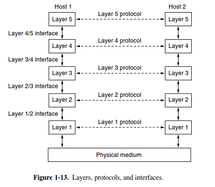

# What is Computer Networking?

Computer networking refers to connected **computing devices** (such as laptops, desktops, servers, smartphones, and tablets) and an **ever-expanding array of IoT devices** (such as cameras, door locks, doorbells, refrigerators, audio/visual systems, thermostats, and various sensors) that communicate with one another.

## Basic terms

### Client

A client is a computer hardware device or software that accesses a service made available by a server.
The server is often (but not always) located on a separate physical computer.

### Server

A server is a physical computer dedicated to run services to serve the needs of other computers.
Depending on the service that is running, it could be a file server, database server, home media server, print server, or web server.

### Host

A host is a computer, connected to other computers for which it provides data or services over a network.
In theory, every computer connected to a network acts as a host to other peers on the network. In essence, a host reflects the logical relationship of two or more computers on a network.

To simplify this, suppose you want to download an image from another computer on your network. That computer is “hosting” the image and therefore, it is the host computer. On the other hand, if that same computer downloads an image from your computer, your computer becomes the host computer.

Your computer can be a host to other computers. Likewise, **your router can be a host to other routers**. But a **host must have an assigned IP address**. Therefore, **modems, hubs, and switches are not considered hosts** because they do not have assigned IP addresses.

### Pear

The peers may be software processes, hardware devices, or even human beings. In other words, it is the peers that communicate by using the protocol to talk to each other.

A five-layer network is illustrated in Fig. 1-13. The entities comprising the corresponding layers on different machines are called peers.

Think of a peer as "someone or something that has the same role/rank/status as the object/person in question". So if you're a student, your fellow-students are your peers. Your tutor is not a peer to you. Your tutor does have peers, that would be the other tutors in that school. Another example, if you have job, your colleagues are your peers, but your superior is not. This can be extended to objects/nodes/layers in computing

### Bandwidth

Network bandwidth is a measurement indicating the maximum capacity of a wired or wireless communications link to transmit data over a network connection in a given amount of time. Typically, bandwidth is represented in the number of bits, kilobits, megabits or gigabits that can be transmitted in 1 second.
Synonymous with capacity, bandwidth describes data transfer rate.
Bandwidth is not a measure of network speed -- a common misconception.

**How does bandwidth work?**
The more bandwidth a data connection has, the more data it can send and receive at one time. In concept, bandwidth can be compared to the volume of water that can flow through a pipe. The wider the pipe's diameter, the more water can flow through it at one time. Bandwidth works on the same principle. The higher the capacity of the communication link, the more data can flow through it per second.

The cost of a network connection goes up as bandwidth increases. Thus, a 1 gigabit per second (Gbps) Dedicated Internet Access (DIA) link will be more expensive than one that can handle 250 megabits per second (Mbps) of throughput.

**Bandwidth vs. speed**
The terms bandwidth and speed are often used interchangeably but not correctly. The cause of the confusion may be due, in part, to advertisements by internet service providers (ISPs) that conflate the two by referring to greater speeds when they truly mean bandwidth.

Essentially, speed refers to the rate at which data can be transmitted, while the definition of bandwidth is the capacity for that speed.
To use the water metaphor again, speed refers to how quickly water can be pushed through a pipe; bandwidth refers to the quantity of water that can be moved through the pipe over a set time frame.

### Jitter

Information is transported from your computer in data packets across the internet.
They are usually sent at regular intervals and take a set amount of time.
Jitter is when there is a time delay in the sending of these data packets over your network connection. This is often caused by network congestion, and sometimes route changes.

Essentially, the longer data packets take to arrive, the more jitter can negatively impact the video and audio quality.

This can be an annoyance when you’re using your computer for recreational purposes. It’s close to unbearable in a professional setting when you’re making a conference call or trying to connect to the team. Jitter can be the difference between a successful voice over internet protocol (VoIP) call and a disastrous, glitchy one.

So, what exactly are data packets and VoIP calls?

- **Data packets**: Although we may not be aware of it, we communicate online through data packets. When one or more of these packets fails to reach their endpoint, that’s when we may experience high jitter.

- **VoIP:** Voice over internet protocol (VoIP) converts your voice into data so that it can be transmitted in the aforementioned packets over the internet. Your voice is broken down into data packets and transmitted across the internet to its destination—the receiver of your call.
  When choosing a VoIP provider, it’s always beneficial to look out for those that have exceptional HD video and audio quality, like RingCentral. It gives you clear, reliable voice and video quality on any device.

**What is acceptable jitter for the internet?**

Jitter is measured in milliseconds (ms). A delay of around 30 ms or more can result in distortion and disruption to a call.

For video streaming to work efficiently, jitter should be below 30 ms. If the receiving jitter is higher than this, it can start to slack, resulting in packet loss and problems with audio quality. Also, packet loss shouldn’t be more than 1%, and network latency shouldn’t go over 150 ms in one direction.

A higher level of internet jitter can cause connectivity problems such as:

1. Delayed calls
2. Dropped calls
3. Static and echoing
4. Distortion or choppy audio

### Packets

In networking, a packet is a small segment of a larger message. Data sent over computer networks, such as the Internet, is divided into packets. These packets are then recombined by the computer or device that receives them.
