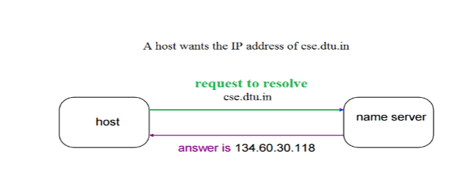
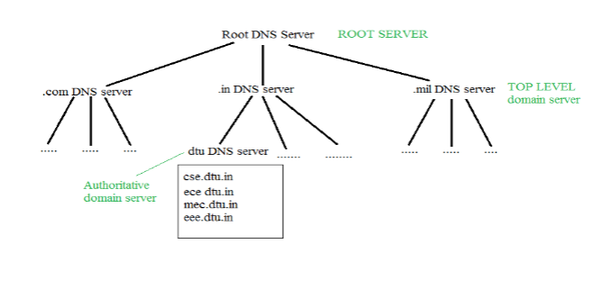
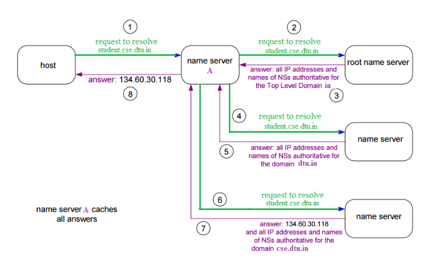

# IMPORTANT

## IP Address

An Internet Protocol (IP) address is the unique identifying number assigned to every device connected to the internet. An IP address definition is a numeric label assigned to devices that use the internet to communicate. Computers that communicate over the internet or via local networks share information to a specific location using IP addresses.
Let us understand it with another example, like if someone wants to send you a mail then he/she must have your home address. Similarly, your computer too needs an address so that other computers on the internet can communicate with each other without the confusion of delivering information to someone else’s computer. And that is why each computer in this world has a unique IP Address.

Or in other words, an IP address is a unique address that is used to identify computers or nodes on the internet. This address is just a string of numbers written in a certain format. It is generally expressed in a set of numbers for example 192.155.12.1. Here each number in the set is from 0 to 255 range. Or we can say that a full IP address ranges from 0.0.0.0 to 255.255.255.255. And these IP addresses are assigned by IANA(known as Internet Corporation For Internet Assigned Numbers Authority).

But what is Internet protocol? This is just a set of rules that makes the internet work. You are able to read this article because your computer or phone has a unique address where the page that you requested has been delivered successfully.

IP addresses have two distinct versions or standards. The Internet Protocol version 4 (IPv4) address is the older of the two, which has space for up to 4 billion IP addresses and is assigned to all computers. The more recent Internet Protocol version 6 (IPv6) has space for trillions of IP addresses, which accounts for the new breed of devices in addition to computers. There are also several types of IP addresses, including public, private, static, and dynamic IP addresses.

### Working of IP addresses

The working of IP addresses is similar to other languages. It can also use some set of rules to send information. Using these protocols we can easily send, and receive data or files to the connected devices. There are several steps behind the scenes.
Let us look at them:

- Your device directly requests your Internet Service Provider which then grants your device access to the web.
- And an IP Address is assigned to your device from the given range available.
- Your internet activity goes through your service provider, and they route it back to you, using your IP address.
- Your IP address can change. For example, turning your router on or off can change your IP Address.
- When you are out from your home location your home IP address doesn’t accompany you. It changes as you change the network of your device.

## DNS(Domain Name System)

The Domain Name System (DNS) is the phonebook of the Internet. Humans access information online through domain names, like nytimes.com or espn.com. Web browsers interact through Internet Protocol (IP) addresses. DNS translates domain names to IP addresses so browsers can load Internet resources. DNS is a distributed database implemented in a hierarchy of name servers.

Each device connected to the Internet has a unique IP address which other machines use to find the device. DNS servers eliminate the need for humans to memorize IP addresses such as 192.168.1.1 (in IPv4), or more complex newer alphanumeric IP addresses such as 2400:cb00:2048:1::c629:d7a2 (in IPv6).

DNS uses UDP and runs on portnumber 53.
In world of internet everything works on IP address. Each device, server and every thing has its own IP address.

### Name-to-Address Resolution(NameServer)

The host requests the DNS name server to resolve the domain name. And the name server returns the IP address corresponding to that domain name to the host so that the host can future connect to that IP address.

### Organization of Domain

It is very difficult to find out the IP address associated with a website because there are millions of websites and with all those websites we should be able to generate the IP address immediately, there should not be a lot of delays for that to happen organization of the database is very important.

- **Hierarchy of Name Servers Root name servers:** It is contacted by name servers that can not resolve the name. It contacts the authoritative name server if name mapping is not known. It then gets the mapping and returns the IP address to the host.
- **Top-level domain (TLD) server:** It is responsible for com, org, edu, etc, and all top-level country domains like uk, fr, ca, in, etc. They have info about authoritative domain servers and know the names and IP addresses of each authoritative name server for the second-level domains.
- **Authoritative name servers** are the organization’s DNS servers, providing authoritative hostnames to IP mapping for organization servers. It can be maintained by an organization or service provider. In order to reach cse.dtu.in we have to ask the root DNS server, then it will point out to the top-level domain server and then to the authoritative domain name server which actually contains the IP address. So the authoritative domain server will return the associative IP address.

### Working of DNS

The client machine sends a request to the local name server, which, if the root does not find the address in its database, sends a request to the root name server, which in turn, will route the query to a top-level domain (TLD) or authoritative name server. The root name server can also contain some hostName to IP address mappings. The Top-level domain (TLD) server always knows who the authoritative name server is. So finally the IP address is returned to the local name server which in turn returns the IP address to the host

Lets say we are requesting to https://geeksforgeeks.org

.gif>)

### DNS Records

Domain name, IP address what is the validity? what is the time to live? and all the information related to that domain name. These records are stored in a tree-like structure.
We’ll go through some of the most common ones you’re likely to encounter.

- **A Record –**
  For example, 104.26.10.228 is an IPv4 address that these entries resolve to.

- **AAAA Record –**
  For example, 2506:4700:20::681a:bc6 resolves to an IPv6 address.

- **CNAME Record –**
  For example, the subdomain name of Geeksforgeeks’s online shop is marketing.geeksforgeeks.org, which gives a CNAME record of marketing.shopify.com. To determine the IP address, another DNS request will be sent to marketing.shopify.com.
  To handle subdomain CNAME record are used. for example when user request on blog.piyushgarg.dev it return CNAME of subdomain which is basically name of some other data network such as hashnode.network then it will find A record of hashnode.network and returns it value. It is just like creating a link. We can think of keeping A record of hashnode.network as value of subdomain but if hashnode.network changes its A record then we have to update values here.

- **MX Record –**
  These records point to the servers that handle the email for the domain you are looking for. For example, the MX record response for geeksforgeeks.com would look like alt1.aspmx.l.google.com. There is also a priority sign on these documents. It instructs the client in which order to try the servers. This is useful when the primary server fails and the email needs to be sent to a backup server.

- **TXT Record –**
  TXT records are text fields that can be used to store any text-based data. TXT records can be used for a variety of things, but one of the most common is to identify the server that has the authorization to send an email on behalf of the domain (this can help in the fight against spam and fake email). is). They can also be used to verify domain ownership when registering for third-party services.

- **NS(Name Server)** record give authoritative information of server which is responsible for handling requests.By using NS server we can create our own dns servers.Name server work as:
  if domain has its name server it will return domain or ip of other server. then we have to ask resultant server to get final ip address.
