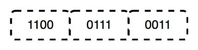
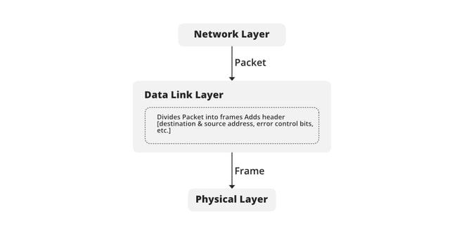

# OSI MODEL

- OSI stands for **Open Systems Interconnection**, is a reference framework that explains the process of transmitting data between computers.
- The OSI reference model was developed by ISO – ‘International Organization for Standardization‘, in the year 1984.
- It is a 7-layer architecture with each layer having specific functionality to perform. All seven layers that work together to carry out specialized network functions, allowing for a more systematic approach to networking.

## What are the 7 layers of the OSI Model?

The OSI model consists of seven abstraction layers arranged in a top-down order:

1. Physical Layer
2. Data Link Layer
3. Network Layer
4. Transport Layer
5. Session Layer
6. Presentation Layer
7. Application Layer

## Physical Layer – Layer 1

- The lowest layer of the OSI reference model is the physical layer. It is responsible for the actual physical connection between the devices.
- The physical layer contains information in the form of bits. It is responsible for transmitting individual bits from one node to the next.
- When receiving data, this layer will get the signal received and convert it into 0s and 1s and send them to the Data Link layer, which will put the frame back together.

Data Bits in the Physical Layer

### Functions of the Physical Layer

1. **Bit synchronization:** The physical layer provides the synchronization of the bits by providing a clock. This clock controls both sender and receiver thus providing synchronization at the bit level.
2. **Bit rate control:** The Physical layer also defines the transmission rate i.e. the number of bits sent per second.
3. **Physical topologies:** Physical layer specifies how the different, devices/nodes are arranged in a network i.e. bus, star, or mesh topology.
4. **Transmission mode:** Physical layer also defines how the data flows between the two connected devices. The various transmission modes possible are Simplex, half-duplex and full-duplex.

## Data Link Layer (DLL) – Layer 2

The data link layer is responsible for the node-to-node delivery of the message.
The main function of this layer is to make sure data transfer is error-free from one node to another, over the physical layer.
When a packet arrives in a network, it is the responsibility of the DLL to transmit it to the Host using its MAC address.

The Data Link Layer is divided into two sublayers:

1. **Logical Link Control (LLC):**
   This sublayer of the data link layer deals with multiplexing, the flow of data among applications and other services, and LLC is responsible for providing error messages and acknowledgments as well.
2. **Media Access Control (MAC):**
   MAC sublayer manages the device’s interaction, responsible for addressing frames, and also controls physical media access.

The packet received from the Network layer is further divided into frames depending on the frame size of the NIC(Network Interface Card). DLL also encapsulates Sender and Receiver’s MAC address in the header.

The Receiver’s MAC address is obtained by placing an ARP(Address Resolution Protocol) request onto the wire asking “Who has that IP address?” and the destination host will reply with its MAC address.

## Functions of the Data Link Layer

- Framing: Framing is a function of the data link layer. It provides a way for a sender to transmit a set of bits that are meaningful to the receiver. This can be accomplished by attaching special bit patterns to the beginning and end of the frame.
- Physical addressing: After creating frames, the Data link layer adds physical addresses (MAC addresses) of the sender and/or receiver in the header of each frame.
- Error control: The data link layer provides the mechanism of error control in which it detects and retransmits damaged or lost frames.
- Flow Control: The data rate must be constant on both sides else the data may get corrupted thus, flow control coordinates the amount of data that can be sent before receiving an acknowledgment.
- Access control: When a single communication channel is shared by multiple devices, the MAC sub-layer of the data link layer helps to determine which device has control over the channel at a given time.

**Note:**

1. Packet in the Data Link layer is referred to as Frame.
2. Data Link layer is handled by the NIC (Network Interface Card) and device drivers of host machines.
3. Switch & Bridge are Data Link Layer devices.

## Network Layer – Layer 3

- The network layer works for the transmission of data from one host to the other located in different networks.
- It also takes care of packet routing i.e. selection of the shortest path to transmit the packet, from the number of routes available.
- The sender & receiver’s IP addresses are placed in the header by the network layer.

### Functions of the Network Layer

- **Routing:** The network layer protocols determine which route is suitable from source to destination. This function of the network layer is known as routing.
- **Logical Addressing:** To identify each device inter-network uniquely, the network layer defines an addressing scheme. The sender & receiver’s IP addresses are placed in the header by the network layer. Such an address distinguishes each device uniquely and universally.

**Note:**

1. Segment in the Network layer is referred to as Packet.
2. Network layer is implemented by networking devices such as routers and switches.

## Transport Layer – Layer 4

The transport layer provides services to the application layer and takes services from the network layer.
The data in the transport layer is referred to as Segments. It is responsible for the end-to-end delivery of the complete message.
The transport layer also provides the acknowledgment of the successful data transmission and re-transmits the data if an error is found.

**At the sender’s side:** The transport layer receives the formatted data from the upper layers, performs **Segmentation**, and also implements **Flow and error control** to ensure proper data transmission.
It also adds **Source and Destination port numbers** in its header and forwards the segmented data to the Network Layer.

    Note:
    *The sender needs to know the port number associated with the receiver’s application.*

    *Generally, this destination port number is configured, either by default or manually. For example, when a web application requests a web server, it typically uses port number 80, because this is the default port assigned to web applications. Many applications have default ports assigned.*

    *At the receiver’s side: Transport Layer reads the port number from its header and forwards the Data which it has received to the respective application. It also performs sequencing and reassembling of the segmented data.*

### Functions of the Transport Layer

- **Segmentation and Reassembly:** This layer accepts the message from the (session) layer, and breaks the message into smaller units. Each of the segments produced has a header associated with it. The transport layer at the destination station reassembles the message.
- **Service Point Addressing:** To deliver the message to the correct process, the transport layer header includes a type of address called service point address or port address. Thus by specifying this address, the transport layer makes sure that the message is delivered to the correct process.

### Services Provided by Transport Layer

1. Connection-Oriented Service
2. Connectionless Service

#### Connection-Oriented Service

It is a three-phase process that includes:

1. Connection Establishment
2. Data Transfer
3. Termination/disconnection

In this type of transmission, the receiving device sends an acknowledgment, back to the source after a packet or group of packets is received. This type of transmission is reliable and secure.

#### Connectionless service

It is a one-phase process and includes Data Transfer. In this type of transmission, the receiver does not acknowledge receipt of a packet.
This approach allows for much faster communication between devices.
Connection-oriented service is more reliable than connectionless Service.

**Note:**

1. Data in the Transport Layer is called Segments.
2. Transport layer is operated by the Operating System. It is a part of the OS and communicates with the Application Layer by making system calls.
3. The transport layer is called as **Heart of the OSI model**.
4. Device or Protocol Use : TCP, UDP NetBIOS, PPTP

## Session Layer – Layer 5

- A session is the total time devoted to an activity.
- This layer is responsible for the establishment of connection, maintenance of sessions, and authentication, and also ensures security.

### Functions of the Session Layer

- **Session establishment, maintenance, and termination:** The layer allows the two processes to establish, use, and terminate a connection.
- **Synchronization:** This layer allows a process to add checkpoints that are considered synchronization points in the data. These synchronization points help to identify the error so that the data is re-synchronized properly, and ends of the messages are not cut prematurely and data loss is avoided.
- **Dialog Controller:** The session layer allows two systems to start communication with each other in half-duplex or full-duplex.

**Note:**

1. All the below 3 layers(including Session Layer) are integrated as a single layer in the TCP/IP model as the “Application Layer”.
2. Implementation of these 3 layers is done by the network application itself. These are also known as Upper Layers or Software Layers.
3. Device or Protocol Use : NetBIOS, PPTP.

## Presentation Layer – Layer 6

- The presentation layer is also called the Translation layer.
- The data from the application layer is extracted here and manipulated as per the required format to transmit over the network.

### Functions of the Presentation Layer

- **Translation:** For example, ASCII to EBCDIC.
- **Encryption/ Decryption:** Data encryption translates the data into another form or code. The encrypted data is known as the ciphertext and the decrypted data is known as plain text. A key value is used for encrypting as well as decrypting data.
- **Compression:** Reduces the number of bits that need to be transmitted on the network.

**Note:** Device or Protocol Use: JPEG, MPEG, GIF

## Application Layer – Layer 7

At the very top of the OSI Reference Model stack of layers, we find the Application layer which is implemented by the network applications.
These applications produce the data to be transferred over the network.
This layer also serves as a window for the application services to access the network and for displaying the received information to the user.

**Example:** Application – Browsers, Skype Messenger, etc.

**Note:**

1. The application Layer is also called Desktop Layer.
2. Device or Protocol Use : SMTP

### Functions of the Application Layer

- **Network Virtual Terminal(NVT):** It allows a user to log on to a remote host.
- **File transfer access and management(FTAM):** This application allows a user to access files in a remote host, retrieve files in a remote host, and manage or control files from a remote computer.
- **Mail Services:** Provide email service.
- **Directory Services:** This application provides distributed database sources and access for global information about various objects and services.

Note: The OSI model acts as a reference model and is not implemented on the Internet because of its late invention. The current model being used is the TCP/IP model.
