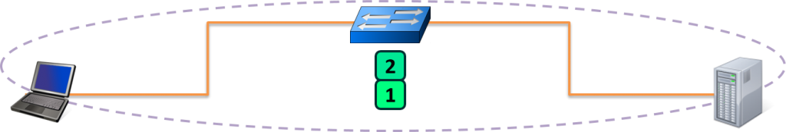

# Packet Traveling

When data leaves your computer, it is grouped into small chunks called Packets. These packets are essentially little envelopes that carry data across the Internet.

This article is going to explain everything that happens to get one of these Packets from one side of the Internet to the other.

## OSI Model

The OSI model is divided into seven different layers, each of which fulfills a very specific function. When combined together, each function contributes to enables full computer to computer data communication.

### OSI Layer 1 – Physical

The Physical layer of the OSI model is responsible for the transfer of bits — the 1’s and 0’s which make up all computer code.

This layer represents the physical medium which is carrying the traffic between two nodes. An example would be your Ethernet cable or Serial Cable.

But don’t get too caught up on the word “Physical” — this layer was named in the 1970s, long before wireless communication in networking was a concept. As such, WiFi, despite it not having a physical, tangible presence, is also considered a Layer 1 protocol.

Simply put, **Layer 1 is anything that carries 1’s and 0’s between two nodes.**

The actual format of the data on the “wire” can vary with each medium. In the case of Ethernet, bits are transferred in the form of **electric pulses**. In the case of Wifi, bits are transferred in the form of **radio waves**. In the case of Fiber, bits are transferred in the form of **pulses of light**.

Aside from the physical cable, Repeaters and Hubs also operate at this layer.

A Repeater simply repeats a signal from one medium to the other, allowing a series of cables to be daisy chained together and increase the range a signal can travel beyond the single cable limit. These are commonly used in large WiFi deployments, where a single WiFi network is “repeated” throughout multiple access-points to cover a larger range.

A Hub is simply a multi-port Repeater. If four devices are connected to a single Hub, anything sent by one device gets repeated to the other three.

### OSI Layer 2 – Data Link

The Data Link layer of the OSI model is responsible for **interfacing with the Physical layer**. Effectively,**Layer 2 is responsible for putting 1’s and 0’s on the wire, and pulling 1’s and 0’s from the wire.**

The **Network Interface Card (NIC) that you plug your Ethernet wire into handles the Layer 2 functionality**. It receives signals from the wire, and transmits signals on to the wire.

Your WiFi NIC works the same way, receiving and transmitting radio waves which are then interpreted as a series of 1’s and 0’s.

**Layer 2 will then group together those 1’s and 0’s into chunks known as Frames.**

There is an addressing system that exists at Layer 2 known as the Media Access Control address, or MAC address. **The MAC address uniquely identifies each individual NIC**. Each NIC is pre-configured with a MAC address by the manufacturer; in fact, it is sometimes referred to as the Burned In Address (BIA).

Aside from your NIC, a Switch also operates at this layer. A Switch’s primary responsibility is to facilitate communication within Networks.

The overarching function of the Data Link layer is to **deliver packets from one NIC to another**. Or to put it another way, the role of **Layer 2 is to deliver packets from hop to hop**.

### OSI Layer 3 – Network

The Network layer of the OSI model is responsible for **packet delivery from end to end**.

It does this by using another addressing scheme, This addressing scheme is known as the Internet Protocol address, or the IP Address.

It is considered logical because an IP address is not a permanent identification of a computer. Unlike the MAC address which is considered a physical address, the IP address is not burned into any computer hardware by the manufacturer.

**Router are Network Devices that operate at Layer 3** of the OSI model. A Router’s primary responsibility is to facilitate communication between Networks. As such, a Router creates a boundary between two networks. In order to communicate with any device not directly in your network, a router must be used.

### OSI Model – Layer 2 vs. Layer 3

The interaction and distinction between Layer 2 and Layer 3 is crucial to understanding how data flows between two computers. For example, if we already have a unique L2 addressing scheme on every NIC (like MAC addresses), why do we need yet another addressing scheme at L3 (like IP addresses)? Or vice versa?

The answer is that both addressing schemes accomplish different functions:

- Layer 2 uses MAC addresses and is responsible for packet delivery from hop to hop.
- Layer 3 uses IP addresses and is responsible for packet delivery from end to end.

When a computer has data to send, it encapsulates it in a IP header which will include information like the Source and Destination IP addresses of the two “ends” of the communication.

The IP Header and Data are then further encapsulated in a MAC address header, which will include information like the Source and Destination MAC address of the current “hop” in the path towards the final destination.

Here is an illustration to drive this point home:

Notice between each Router, the MAC address header is stripped and regenerated to get it to the next hop. The IP header generated by the first computer is only stripped off by the final computer, hence the IP header handled the “end to end” delivery, and each of the four different MAC headers involved in this animation handled the “hop to hop” delivery.

### OSI Layer 4 – Transport

The Transport layer of the OSI model is **responsible for distinguishing network streams**.

At any given time on a user’s computer there might be an Internet browser open, while music is being streamed, while a messenger or chat app is running. Each of these applications are sending and receiving data from the Internet, and all that data is arriving in the form of 1’s and 0’s on to that computer’s NIC.

Something has to exist in order to distinguish which 1’s and 0’s belong to the messenger or the browser or the streaming music. That “something” is Layer 4:

**Layer 4 accomplishes this by using an addressing scheme known as Port Numbers.**

Specifically, two methods of distinguishing network streams exist. They are known as the Transmission Control Protocol (TCP), or the User Datagram Protocol (UDP).

Both TCP and UDP have 65,536 port numbers (each), and a unique application stream is identified by both a Source and Destination port (in combination with their Source and Destination IP address).

TCP and UDP employ different strategies in how data streams are transferred, and their distinction and inner workings are both fascinating and significant.

To summarize, if Layer 2 is responsible for hop to hop delivery, and Layer 3 is responsible for end to end delivery, it can be said that **Layer 4 is responsible for service to service delivery**.

### OSI Layer 5, 6, and 7

The Session, Presentation, and Application layers of the OSI model handle the final steps before the data transferred through the network (facilitated by layers 1-4) is displayed to the end user.

### Encapsulation and Decapsulation

The last item we need to discuss before we move on from the OSI Model is that of Encapsulation and Decapsulation. These terms refer to **how data is moved through the layers from top to bottom when sending and from bottom to top when receiving**.

As the data is handed from layer to layer, each layer adds the information it requires to accomplish its goal before the complete datagram is converted to 1s and 0s and sent across the wire. For example:

- Layer 4 will add a TCP header which would include a Source and Destination port
- Layer 3 will add an IP header which would include a Source and Destination IP address
- Layer 2 would add an Ethernet header which would include a Source and Destination MAC address

On the receiving end, each layer strips the header from the data and passes it back up the stack towards the Application layers. Here is the whole process in action:

Note that this is only an example. The header that will be added will be dependent on the underlying communication protocol. For instance, a UDP header might be added at Layer 4 instead, or an IPv6 header might be added at Layer 3.

## Key Players

### Switch

A Switch is a network device whose primary purpose is to **facilitate communication within networks**.

**Switches operate at Layer 2 of the OSI model**, which means they only look into each data-gram up to the Layer 2 header. The Layer 2 header contains information that enables hop to hop delivery, such as the Source and Destination MAC address.

A Switch operates by maintaining what is known as a **MAC Address table.** This is a table that maps MAC addresses of devices plugged into each switch port. A typical switch has many ports, from 24 to 48, up to 96, or more.

The **MAC Address Table is populated by looking at the Source MAC address field** of any received frames.

In order to forward the frame, the Switch will lookup the Destination MAC address in their MAC Address Table to **determine what port to use**.

If a Switch encounters a frame for which it does not know the location of the Destination MAC address, it simply duplicates and **floods the frame out each switch port** (except the port it was received on).

### Router

A Router is a network device whose primary purpose is to facilitate communication between networks. **Each interface on a router creates a network boundary.**

**Routers operate at Layer 3 of the OSI Model**, which means they only look into each datagram up to the Layer 3 header. The Layer 3 header contains information that enables end to end delivery, such as the Source and Destination IP Address.

In the image above, notice that the router on the left (R1) and the router on the right (R2) create three separate networks (11.11.11.x, 22.22.22.x, and 33.33.33.x). R1’s right interface and R2’s left interface are both on the same network.

The only way for the Client in the 11.11.11.x network to speak to the Server in the 33.33.33.x network is to forward the packet to R1, who will in turn forward the packet to R2, who will then finally forward the packet to the Server.

A Router accomplishes all this by maintaining what is known as a **Routing Table**. This is a table that **contains paths to all the networks a Router knows how to reach**. These paths are sometimes known as Routes, and each entry contains an IP Network and either an interface or the IP address of the next router in the path to the target.

There are multiple ways a Router can learn of a network and populate its Routing Table.

Keep in mind, from the perspective of each router, the **Route Table is a map of every network that exists**. If a router receives a packet destined to a network it does not know about, then as far as that router is concerned, that network must not exist. Therefore,**when a router receives a packet destined to a network which is not in its Routing Table, that packet is discarded**.

### Address Resolution Protocol (ARP)

Earlier we discussed that MAC addresses are a Layer 2 addressing scheme. We also discussed that IP addresses are a Layer 3 addressing scheme.

What bridges these two addressing schemes is the Address Resolution Protocol (ARP).

Typically, when two hosts are communicating, they already know each other’s IP address. They can know each other’s IP address from a variety of methods: sometimes it is manually provided by a user, sometimes by another protocol (often DNS).

However, what is definitely not known is their MAC addresses. The hosts will use ARP to discover the appropriate MAC address. To put it another way, **ARP will use the known IP address, and discover the unknown MAC address**. The discovered mapping is then added and stored in an **ARP Table, which is a mapping of IP addresses to correlating MAC addresses**.

We’ll describe how L2 and L3 are bridged together, and ARP’s role in the process using the following illustration:

In the image above, there are three networks: the purple network, the gray network, and the red network. We’ll use this diagram to illustrate two instances of ARP: First when a host is speaking to another host in the same network (Client to Purple server). And Second when a host is speaking to another host in a different network (Client to Red server).

When the Client needs to speak to the Purple Server, it will know the Purple Server’s IP address, and from that it will determine that the Purple Server exists in the local network. **When a Client is attempting to speak to a host in the same network, the Client will issue an ARP request for the host’s MAC address**.

ARP will allow the Client to complete the Layer 2 header as follows:

When the Client needs to speak to the Red Server, it will know the Red Server’s IP address, and from that it will know that the Red Server exists in a foreign network. As such, the packet must be delivered to the nearest router — otherwise known as the Default Gateway.

The Client is generally already configured with a Default Gateway — which we can tell from the image will be the R1. **It will request ARP with ip of Default Gateway(Router) and ask Router MAC address.** When a Client is attempting to speak to a host in a foreign network, the Client will issue an ARP request for the Default Gateway’s MAC address.

To summarize ARP’s operation:

- When a Client is speaking to a host in the same network, it will ARP for the MAC address of the host
- When a Client is speaking to a host in a different network, it will ARP for the MAC address of the Default Gateway

Remember, packet delivery is always the job of Layer 2, and Layer 2’s primary goal is getting a packet from hop to hop. Conversely, Layer 3, which is concerned with end to end delivery is unable to put a packet on a wire and send it to another host’s NIC. ARP’s role is to help the client create the proper L2 header, based on the L3 header, in order to get the packet from one hop to the next.

It should also be noted that any device that intends to forward a packet based upon the IP address (L3), must also have the ability to deliver the packet to the next hop (L2). As such, any device that uses IP addresses must also use ARP to deliver the packet using MAC addresses. Consequently, all Layer 3 devices must maintain an ARP Table.

Refer this video for more any confusion: <https://www.youtube.com/watch?v=QPi5Nvxaosw&ab_channel=PracticalNetworking>

## Summary

We discussed the primary purposes of the different layers of the OSI model. Specifically:

- OSI Layer 1 is the physical medium carrying the 1’s and 0’s across the wire
- OSI Layer 2 is responsible for hop to hop delivery and uses MAC addresses
- OSI Layer 3 is responsible for end to end delivery and uses IP Addresses
- OSI Layer 4 is responsible for service to service delivery and uses Port Numbers

We also discussed some of the Key Players involved in moving a packet through the Internet:

- Switches facilitate communications within networks and operate at Layer 2
- Routers facilitate communication between networks and operate at Layer 3
- ARP uses a known IP address to resolve an unknown MAC address

We also discussed three different tables that are use to store different mappings:

- Switches use a MAC Address Table which is a mapping of **Switchports to connected MAC addresses**
- Routers use a Routing Table which is a mapping of known **Networks to interfaces or next-hop addresses**
- All L3 devices use an ARP Table which is a mapping of **IP Addresses to MAC addresses**
