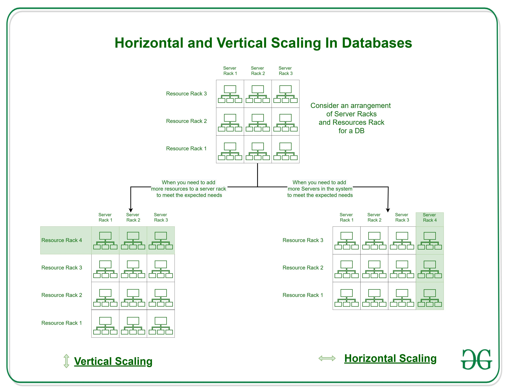
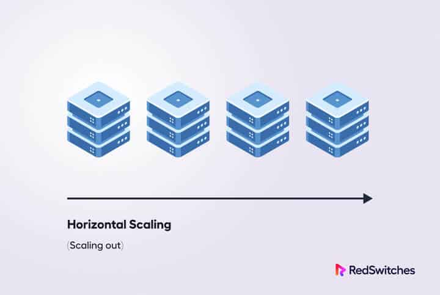
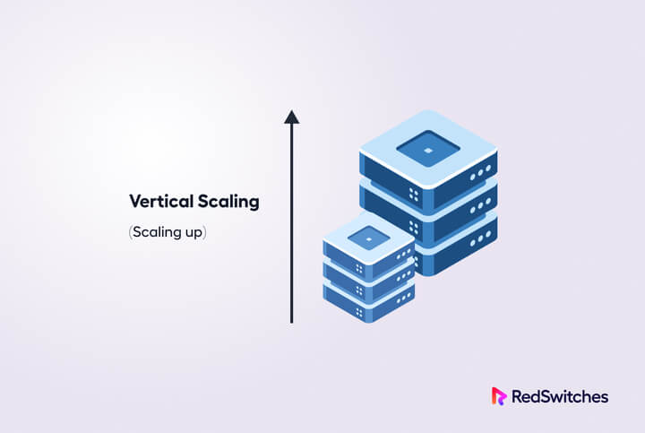

# Scalability

- Scalability is the ability to expand the **system’s existing configuration to handle the increasing load**.
- Scaling can be done by adding hardware or upgrading the current system configuration. There are two major ways to accomplish scaling – vertical scaling and horizontal scaling.

## Horizontal Scaling

- Horizontal scaling is a strategy used to enhance the performance of a dedicated server node by **adding more server instances to the existing pool of servers** so that the load can be equally distributed.
- Horizontal scaling is also known as **scaling out** the infrastructure.

- In horizontal scaling, we do not change the capacity of the individual server. Instead, we decrease the load on individual servers.
- We implement several connected ideas to achieve this effect, such as a distributed file system, clustering, and load–balancing.

- Some reasons businesses choose to scale horizontally include an increase in their I/O concurrency, the need to reduce the load on existing nodes, and the requirement to expand disk capacity. Out of the two scaling options, horizontal scaling is considerably easy as you simply add more machines to the existing infrastructure.You should note that the data is partitioned among the nodes, with each node containing only one part of the data.

- A common scenario where horizontal scaling works the best is when your business website starts receiving a significantly large number of visitors. This additional traffic increases stress on your existing infrastructure, and the website starts to slow down.

- To counter this slowdown, you can add another server to the network. This way, the workload is distributed evenly among the servers.

- The recent increase in online traffic has made many popular websites use horizontal scaling. The list includes instantly recognizable names such as Gmail and YouTube, Yahoo, Facebook, eBay, and Amazon.

- Cassandra and MongoDB are two great examples of horizontal scaling solutions.

### Advantages of Horizontal Scaling

Horizontal scaling comes with a host of benefits, such as:

1. Easily scalable tools.
2. Supporting linear amplifies the capacity.
3. Easier to run fault tolerance.
4. Easy to upgrade.
5. Better use of smaller systems.
6. The cost of implementing is less expensive compared to scaling up.
7. Improved resilience due to the presence of discrete, multiple systems.
8. Horizontal scaling can be used to implement Infinite Scale, where you can use endless instances to enable limitless growth.

### Disadvantages of Horizontal Scaling

But before you jump onto the horizontal scaling bandwagon, you should know that it comes with several drawbacks, including:

1. The architectural design is highly complicated.
2. You might have to pay high licensing fees.
3. Horizontal scaling solutions can increase your utility costs, such as cooling and electricity.
4. You need to invest in extra networking equipment, such as routers and switches.

## Vertical Scaling

- Vertical Scaling is an attempt to **increase the capacity of a single machine**.
- Here the resources, such as processing power, storage, memory, and bandwidth, are added to an existing infrastructure node.
- Vertical Scaling is also called the **Scale-up** approach.

- It can enhance your server architecture without significantly affecting your infrastructure. However, you should know that any vertical scaling scheme could get as big as the size of the individual server.

Let’s take an example of vertical scaling.
Consider that you have a SaaS application that has moved beyond the beta testing. Now, when the number of visitors increases, the demands on the server resources increase. To counter this, you can increase CPU, RAM, and bandwidth to accommodate the users. In this example, you use a vertical scaling model that can enhance the capabilities of the server and node.

- As you can see, Vertical Scaling boosts the power of the individual server to handle the increasing load.
- However, adding more resources in Vertical Scaling is often restricted to the capacity of a single machine.
  Similarly, there is no partitioning of the data because it resides on a single node.

- Small and mid-sized businesses widely use vertical Scaling strategy. One of the most common examples of Virtual Scaling is buying expensive hardware and using it as a Virtual Machine hypervisor.
- Good examples of Vertical Scaling are MySQL and Amazon RDS.

### Advantages of Vertical Scaling

1. Reduced software costs as the underlying hardware nodes often don’t increase.
2. Easy Implementation.
3. Lower licensing fees.
4. Vertical scaling solutions often consume less power.
5. Cooling costs are lower than horizontal scaling.
6. Application compatibility is maintained.

### Disadvantages of Vertical Scaling

1. The limited scope of scaling.
2. The risk for downtime is much higher than horizontal scaling.
3. Greater risk of outages and hardware failures.
4. Finite scope of upgradeability in the future.
5. Severe vendor lock-in.
6. The cost of implementation is expensive.

.png>)
