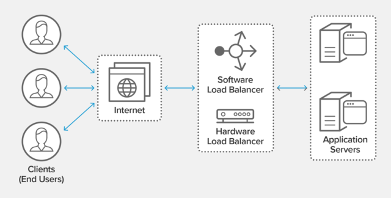

# Load balancing

- Load balancing refers to efficiently distributing incoming network traffic across a group of backend servers, also known as a server farm or server pool.
- It is used in horizontal scaling.

- Modern high‑traffic websites must serve hundreds of thousands, if not millions, of concurrent requests from users or clients and return the correct text, images, video, or application data, all in a fast and reliable manner.
- To cost‑effectively scale to meet these high volumes, modern computing best practice generally requires adding more servers.

- A load balancer **acts as the “traffic cop” sitting in front of your servers and routing client requests across all servers capable of fulfilling those requests in a manner that maximizes speed and capacity utilization and ensures that no one server is overworked**, which could degrade performance. If a single server goes down, the load balancer redirects traffic to the remaining online servers.
- When a new server is added to the server group, the load balancer automatically starts to send requests to it.

In this manner, a load balancer performs the following functions:

- Distributes client requests or network load efficiently across multiple servers
- Ensures high availability and reliability by sending requests only to servers that are online
- Provides the flexibility to add or subtract servers as demand dictates

## Load Balancing Algorithms

Different load balancing algorithms provide different benefits; the choice of load balancing method depends on your needs:

1. **Round Robin** – Requests are distributed across the group of servers sequentially.
2. **Least Connections** – A new request is sent to the server with the fewest current connections to clients. The relative computing capacity of each server is factored into determining which one has the least connections.
3. **Least Time**– Sends requests to the server selected by a formula that combines the fastest response time and fewest active connections.
4. **Hash** – Distributes requests based on a key you define, such as the client IP address or the request URL. NGINX Plus can optionally apply a consistent hash to minimize redistribution of loads if the set of upstream servers changes.
5. **IP Hash** – The IP address of the client is used to determine which server receives the request.
6. **Random with Two Choices** – Picks two servers at random and sends the request to the one that is selected by then applying the Least Connections algorithm.

## Benefits of Load Balancing

- Reduced downtime
- Scalable
- Redundancy
- Flexibility
- Efficiency
