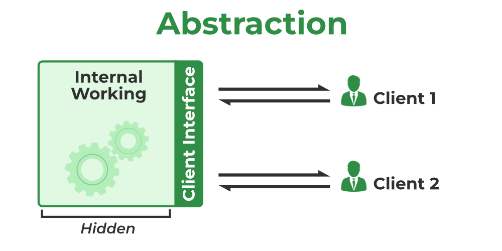
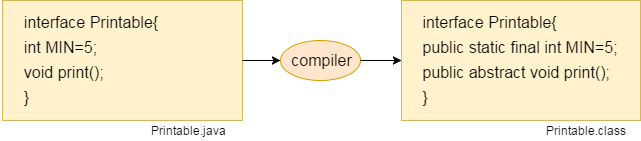

# Abstraction in Java

Abstraction is a process of hiding the **implementation details**and **showing only functionality** to the user.

Another way, it shows only essential things to the user and hides the internal details, for example, sending SMS where you type the text and send the message. You don't know the internal processing about the message delivery.

Abstraction lets you focus on what the object does instead of how it does it.



## Ways to achieve Abstraction

There are two ways to achieve abstraction in java

- Abstract class **(0 to 100%)**
- Interface **(100%)**

## Abstract class in Java

A class which is declared as abstract is known as an abstract class. It can have abstract and non-abstract methods. It needs to be extended and its method implemented. It cannot be instantiated.

### Points to Remember

- An abstract class must be declared with an abstract keyword.
- It can have abstract and non-abstract methods.
- It cannot be instantiated.
- It can have constructors and static methods also.
- It can have final methods which will force the subclass not to change the body of the method.

Example of abstract class

    abstract class A{}

Example of abstract method

    abstract void printStatus();//no method body and abstract

In this example, Bike is an abstract class that contains only one abstract method run. Its implementation is provided by the Honda class.

    ```java
    abstract class Bike{
        abstract void run();
    }

    class Honda4 extends Bike{
        void run(){System.out.println("running safely");}

        public static void main(String args[]){
            Bike obj = new Honda4();
            obj.run();
        }
    }
    ```

Other Examples:

    ```java
    abstract class Bike{
        Bike(){System.out.println("bike is created");}
        abstract void run();
        void changeGear(){System.out.println("gear changed");}
    }

    //Creating a Child class which inherits Abstract class
    class Honda extends Bike{
        void run(){System.out.println("running safely..");}
    }
    //Creating a Test class which calls abstract and non-abstract methods
    class TestAbstraction2{
        public static void main(String args[]){
            Bike obj = new Honda();
            obj.run();
            obj.changeGear();
        }
    }
    ```

## Interface in Java

An interface in Java is a blueprint of a class.
It has static constants and abstract methods.

The interface in Java is a mechanism to achieve abstraction. There **can be only abstract methods in the Java interface**, **not method body**.
It is used to achieve abstraction and multiple inheritance in Java.

In other words, you can say that interfaces can have abstract methods and variables. It cannot have a method body.

Java Interface also represents the IS-A relationship.

It **cannot be instantiated** just like the abstract class.

## Why use Java interface?

There are mainly three reasons to use interface. They are given below.

- It is used to achieve abstraction.
- By interface, we can support the functionality of multiple inheritance.
- It can be used to achieve loose coupling.

## How to declare an interface?

An interface is declared by using the interface keyword.
It provides total abstraction; means all the methods in an interface are **declared with the empty body**, and all the fields are **public, static and final** by default.
A class that implements an interface **must implement all the methods declared** in the interface.

    ```java
    interface <interface_name>{

        // declare constant fields
        // declare methods that abstract
        // by default.
    }
    ```

Interface fields are **public, static and final** by default, and the methods are **public and abstract**.



### The relationship between classes and interfaces


A class extends another class, an interface extends another interface, but a class implements an interface.

    ```java
    interface printable{
        void print();
    }
    class A6 implements printable{
        public void print(){System.out.println("Hello");}

        public static void main(String args[]){
            A6 obj = new A6();
            obj.print();
        }
    }
    ```

## Multiple inheritance in Java by interface


If a class implements multiple interfaces, or an interface extends multiple interfaces, it is known as multiple inheritance.

    ```java
    interface Printable{
        void print();
    }
    interface Showable{
        void show();
    }
    class A7 implements Printable,Showable{
        public void print(){System.out.println("Hello");}
        public void show(){System.out.println("Welcome");}

        public static void main(String args[]){
            A7 obj = new A7();
            obj.print();
            obj.show();
        }
    }
    ```

**Multiple inheritance is not supported through class in java, but it is possible by an interface, why?**

As we have explained in the inheritance chapter, multiple inheritance is not supported in the case of class because of ambiguity. However, it is supported in case of an interface because there is no ambiguity. It is because its implementation is provided by the implementation class. For example:

    ```java
    interface Printable{
        void print();
    }
    interface Showable{
        void print();
    }

    class TestInterface3 implements Printable, Showable{
        public void print(){System.out.println("Hello");}
        public static void main(String args[]){
            TestInterface3 obj = new TestInterface3();
            obj.print();
        }
    }
    ```

As you can see in the above example, Printable and Showable interface have same methods but its implementation is provided by class TestTnterface1, so there is no ambiguity.

### Are there any limitations on Inheritance?

Yes, there are more challenges when you have more authority. Although inheritance is a very strong OOPs feature, it also has significant drawbacks.

- As it must pass through several classes to be implemented, inheritance takes longer to process.
- The base class and the child class, which are both engaged in inheritance, are also closely related to one another (called tightly coupled). Therefore, if changes need to be made, they may need to be made in both classes at the same time.
- Implementing inheritance might be difficult as well. Therefore, if not implemented correctly, this could result in unforeseen mistakes or inaccurate outputs.

### How is an abstract class different from an interface?

Both abstract classes and interfaces are special types of classes that just include the declaration of the methods, not their implementation. An abstract class is completely distinct from an interface, though. Following are some major differences between an abstract class and an interface.

| Abstract Class | Interface |
| -------------- | --------- |

|When an abstract class is inherited, however, the subclass is not required to supply the definition of the abstract method until and unless the subclass actually uses it.| When an interface is implemented, the subclass is required to specify all of the interface’s methods as well as their implementation.|
|A class that is abstract can have both abstract and non-abstract methods. |An interface can only have abstract methods.|
|An abstract class can have final, non-final, static and non-static variables. |The interface has only static and final variables.|
|Abstract class doesn’t support multiple inheritance.| An interface supports multiple inheritance.|

### What are virtual functions?

Virtual functions are functions that are present in the parent class and are overridden by the subclass. These functions are used to achieve runtime polymorphism.

### What are pure virtual functions?

Pure virtual functions or abstract functions are functions that are only declared in the base class. This means that they do not contain any definition in the base class and need to be redefined in the subclass.
