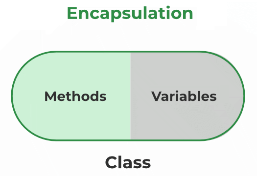

# Encapsulation in Java

Encapsulation is the binding of data and methods that manipulate them into a single unit such that the sensitive data is hidden from the users

We can create a fully encapsulated class in Java by making all the data members of the class **private**. Now we can use setter and getter methods to set and get the data in it.

## Advantage of Encapsulation in Java

- By providing only a **setter or getter** method, you can make the class read-only or write-only.
- It provides you the **control over the data**.
- It is a way to achieve **data hiding** in Java because other class will not be able to access the data through the private data members.
- The encapsulate class is **easy to test**. So, it is better for unit testing.

## Examples

`````java
    //simple demonstration of encapsulation
    //It has a private data member and getter and setter methods.
    public class Student{
        //private data members
        private String name;
        private int rollNo;
        //public getter method to access the name
        public String getName(){
            return name;
        }
    //public getter method to access rollNo
        public int getRollNo(){
            return rollNo;
        }
    //public setter method to set name
        public void setName(String name){
                this.name=name
        }
    //public setter method to set rollNo
        public void setRollNo(int rollNo){
                this.rollNo=rollNo;
        }
    }
    ```

````java
    //A Java class which is a fully encapsulated class.
    //It has a private data member and getter and setter methods.

    public class Student{
        //private data member
        private String name;

        //getter method for name
        public String getName(){
            return name;
        }

        //setter method for name
        public void setName(String name){
            this.name=name
        }
    }

    class Test{
        public static void main(String[] args){
            Student s=new Student();
            //setting value in the name member
            s.setName("vijay");
            //getting value of the name member
            System.out.println(s.getName());
        }
    }
    ```
`````

## Encapsulation is implemented as the processes mentioned below

1. **Data hiding**: A language feature to restrict access to members of an object. For example, private and protected members.
2. **Bundling of data and methods together**: Data and methods that operate on that data are bundled together. For example, the data members and member methods that operate on them are wrapped into a single unit known as a class.



## Access Modifiers in Java

Access specifiers are special types of keywords that are used to specify or control the accessibility of entities like classes, methods, and so on. Private, Public, and Protected are examples of access specifiers or access modifiers.
The key components of OOPs, encapsulation and data hiding, are largely achieved because of these access specifiers.
The access modifiers in Java specifies the accessibility or scope of a field, method, constructor, or class.

### There are four types of Java access modifiers

1. **Private**: The access level of a private modifier is only within the class. It cannot be accessed from outside the class.

2. **Default**: The access level of a default modifier is only within the package. It cannot be accessed from outside the package. If you do not specify any access level, it will be the default.

3. **Protected**: The access level of a protected modifier is within the package and outside the package through child class. If you do not make the child class, it cannot be accessed from outside the package.

````java

   package pack;
   public class A{
   public void msg(){System.out.println("Hello");}
   }

   //save by B.java
   package mypack;
   import pack.*;

   class B{
   public static void main(String args[]){
   A obj = new A();
   obj.msg();
   }
   }  ```
   Output:Hello

````

4. **Public**: The access level of a public modifier is everywhere. It can be accessed from within the class, outside the class, within the package and outside the package.

.png>)
