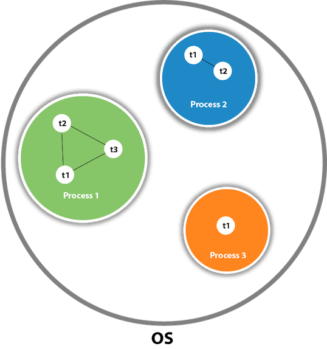
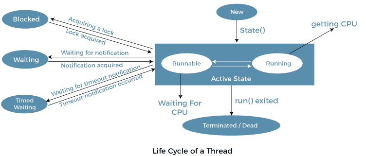

# Multithreading in Java

Multithreading in Java is a process of executing multiple threads simultaneously.
Multithreading is a Java feature that allows concurrent execution of two or more parts of a program for maximum utilization of CPU.
Each part of such program is called a thread.
Threads are light-weight processes within a process.

Multiprocessing and multithreading, both are used to achieve multitasking.

However, we use multithreading than multiprocessing because threads use a shared memory area. They don't allocate separate memory area so saves memory, and context-switching between the threads takes less time than process.

Java Multithreading is mostly used in games, animation, etc.

## What is Thread in java?

A thread is a lightweight subprocess, the smallest unit of processing. It is a separate path of execution.

Threads are independent. If there occurs exception in one thread, it doesn't affect other threads. It uses a shared memory area.



As shown in the above figure, a thread is executed inside the process. There is context-switching between the threads. There can be multiple processes inside the OS, and one process can have multiple threads.

## Threads can be created by using two mechanisms

1. Extending the Thread class
2. Implementing the Runnable Interface

### Thread creation by extending the Thread class

We create a class that extends the **java.lang.Thread** class.
This class overrides the run() method available in the Thread class. A thread begins its life inside run() method.
We create an object of our new class and call start() method to start the execution of a thread. Start() invokes the run() method on the Thread object.

```java
    // Java code for thread creation by extending
    // the Thread class
    class MultithreadingDemo extends Thread {
        public void run()
        {
            try {
                // Displaying the thread that is running
                System.out.println(
                    "Thread " + Thread.currentThread().getId()
                    + " is running");
            }
            catch (Exception e) {
                // Throwing an exception
                System.out.println("Exception is caught");
            }
        }
    }

    // Main Class
    public class Multithread {
        public static void main(String[] args)
        {
            int n = 8; // Number of threads
            for (int i = 0; i < n; i++) {
                MultithreadingDemo object
                    = new MultithreadingDemo();
                object.start();
            }
        }
    }
```

**Output:**
Thread 15 is running
Thread 14 is running
Thread 16 is running
Thread 12 is running
Thread 11 is running
Thread 13 is running
Thread 18 is running
Thread 17 is running

### Thread creation by implementing the Runnable Interface

We create a new class which implements **java.lang.Runnable** interface and override run() method.
Then we instantiate a Thread object and call start() method on this object.

```java
    // Java code for thread creation by implementing
    // the Runnable Interface
    class MultithreadingDemo implements Runnable {
        public void run()
        {
            try {
                // Displaying the thread that is running
                System.out.println(
                    "Thread " + Thread.currentThread().getId()
                    + " is running");
            }
            catch (Exception e) {
                // Throwing an exception
                System.out.println("Exception is caught");
            }
        }
    }

    // Main Class
    class Multithread {
        public static void main(String[] args)
        {
            int n = 8; // Number of threads
            for (int i = 0; i < n; i++) {
                Thread object
                    = new Thread(new MultithreadingDemo());
                object.start();
            }
        }
    }
```

**Output:**
Thread 13 is running
Thread 11 is running
Thread 12 is running
Thread 15 is running
Thread 14 is running
Thread 18 is running
Thread 17 is running
Thread 16 is running

### Thread Class vs Runnable Interface

1. If we extend the Thread class, our class cannot extend any other class because Java doesn’t support multiple inheritance. But, if we implement the Runnable interface, our class can still extend other base classes.
2. We can achieve basic functionality of a thread by extending Thread class because it provides some inbuilt methods like yield(), interrupt() etc. that are not available in Runnable interface.
3. Using runnable will give you an object that can be shared amongst multiple threads.

## More on Multitasking

Multitasking is a process of executing multiple tasks simultaneously. We use multitasking to utilize the CPU. Multitasking can be achieved in two ways:

- Process-based Multitasking (Multiprocessing)
- Thread-based Multitasking (Multithreading)

1. **Process-based Multitasking (Multiprocessing)**

Each process has an address in memory. In other words, each process allocates a separate memory area.
A process is heavyweight.
Cost of communication between the process is high.
Switching from one process to another requires some time for saving and loading registers, memory maps, updating lists, etc. 2. **Thread-based Multitasking (Multithreading)**

Threads share the same address space.
A thread is lightweight.
Cost of communication between the thread is low.

## Life cycle of a Thread (Thread States) //Optional

In Java, a thread always exists in any one of the following states. These states are:

1. New
2. Active
3. Blocked / Waiting
4. Timed Waiting
5. Terminated



### **New:**

Whenever a new thread is created, it is always in the new state.
For a thread in the new state, the code has not been run yet and thus has not begun its execution.

### **Active:**

When a thread invokes the start() method, it moves from the new state to the active state.
The active state contains two states within it: one is runnable, and the other is running.

**Runnable:** A thread, that is ready to run is then moved to the runnable state. In the runnable state, the thread may be running or may be ready to run at any given instant of time. It is the duty of the thread scheduler to provide the thread time to run, i.e., moving the thread the running state.

**Running:** When the thread gets the CPU, it moves from the runnable to the running state. Generally, the most common change in the state of a thread is from runnable to running and again back to runnable.

### Blocked or Waiting

Whenever a thread is inactive for a span of time (not permanently) then, either the thread is in the blocked state or is in the waiting state.

For example, a thread (let's say its name is A) may want to print some data from the printer. However, at the same time, the other thread (let's say its name is B) is using the printer to print some data. Therefore, thread A has to wait for thread B to use the printer. Thus, thread A is in the blocked state. A thread in the blocked state is unable to perform any execution and thus never consume any cycle of the Central Processing Unit (CPU). Hence, we can say that thread A remains idle until the thread scheduler reactivates thread A, which is in the waiting or blocked state.

If there are a lot of threads in the waiting or blocked state, then it is the duty of the thread scheduler to determine which thread to choose and which one to reject, and the chosen thread is then given the opportunity to run.

### Timed Waiting

Sometimes, waiting for leads to starvation. For example, a thread (its name is A) has entered the critical section of a code and is not willing to leave that critical section. In such a scenario, another thread (its name is B) has to wait forever, which leads to starvation. To avoid such scenario, a timed waiting state is given to thread B. Thus, thread lies in the waiting state for a specific span of time, and not forever.
A real example of timed waiting is when we invoke the sleep() method on a specific thread. The sleep() method puts the thread in the timed wait state. After the time runs out, the thread wakes up and start its execution from when it has left earlier.

### Terminated

A thread reaches the termination state because of the following reasons:

- When a thread has finished its job, then it exists or terminates normally.
- Abnormal termination: It occurs when some unusual events such as an unhandled exception or segmentation fault.

A terminated thread means the thread is no more in the system. In other words, the thread is dead, and there is no way one can respawn (active after kill) the dead thread.
