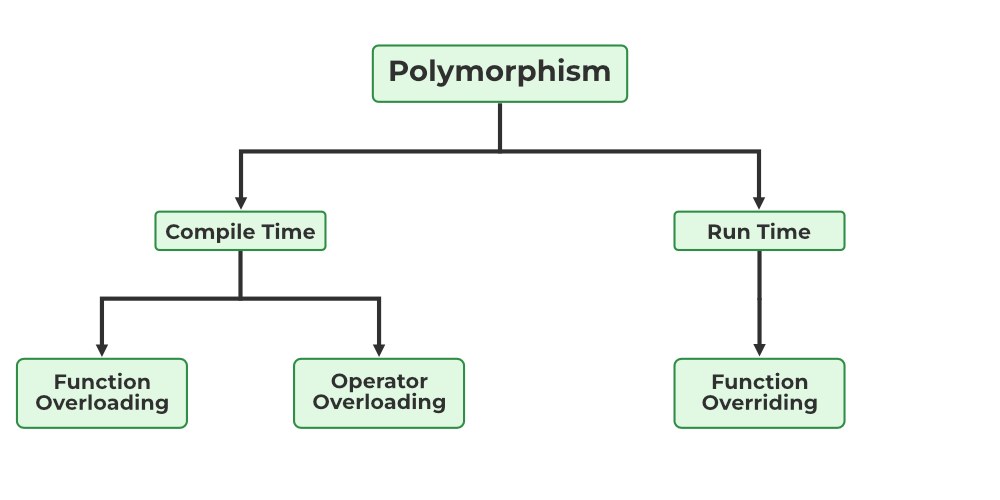

# Polymorphism in Java

Polymorphism in Java is a concept by which we can perform a **single action in different ways**.
Polymorphism is derived from 2 Greek words: poly and morphs. The word "poly" means many and "morphs" means forms. So polymorphism means many forms.

We can perform polymorphism in java by **method overloading** and **method overriding**.

If you overload a static method in Java, it is the example of compile time polymorphism.

## There are two types of polymorphism in Java

- compile-time polymorphism
- runtime polymorphism



## Compile-Time Polymorphism

Compile time polymorphism, also known as static polymorphism or early binding is the type of polymorphism where the binding of the call to its code is done at the compile time.
**Method overloading or operator overloading** are examples of compile-time polymorphism.

## Runtime Polymorphism

Runtime polymorphism or Dynamic Method Dispatch is a process in which a **call to an overridden method is resolved at runtime rather than compile-time.**

In this process, an overridden method is called through the **reference variable of a superclass**. The determination of the method to be called is based on the **object being referred to by the reference variable**.

Let's first understand the upcasting before Runtime Polymorphism.

### Upcasting

If the reference variable of Parent class refers to the object of Child class, it is known as upcasting. For example:

    ```java
    class A{}
    class B extends A{}
    A a=new B();//upcasting
    ```


**Example of Java Runtime Polymorphism:**

In this example, we are creating two classes Bike and Splendor. Splendor class extends Bike class and overrides its run() method. **We are calling the run method by the reference variable of Parent class**. Since it refers to the **subclass object and subclass method overrides the Parent class method**, the **subclass method is invoked at runtime**.

Since method invocation is determined by the JVM not compiler, it is known as runtime polymorphism.

    ```java
    class Bike{
        void run(){System.out.println("running");}
    }
    class Splendor extends Bike{
        void run(){System.out.println("running safely with 60km");
    }

    public static void main(String args[]){
        Bike b = new Splendor();//upcasting
        b.run();
    }
    ```

Output:

running safely with 60km.

## Method Overloading

- **Definition:** A class having multiple methods with the same name but different parameters.
- **Purpose:** Enhances code readability by using the same method name for related operations.

**Advantages:**

- Improved code readability and maintainability.

### Ways to Overload Methods

1.  **Changing Number of Arguments:**

        ```java
        class Adder {
            static int add(int a, int b) { return a + b; }
            static int add(int a, int b, int c) { return a + b + c; }
        }```

2.  **Changing Data Type of Arguments:**

        ```java
        class Adder {
            static int add(int a, int b) { return a + b; }
            static double add(double a, double b) { return a + b; }
        }
        ```

**## Not Possible by Changing Return Type Only:**

- Ambiguity arises when methods differ only in return type.

**## Overloading the `main()` Method:**

- Yes, it's possible, but JVM calls the `main(String[] args)` method specifically.

**## Type Promotion and Overloading:**

- Java implicitly promotes arguments to avoid ambiguity.

## Method Overriding in Java

If subclass (child class) has the same method as declared in the parent class, it is known as method overriding in Java.

In other words, If a subclass provides the specific implementation of the method that has been declared by one of its parent class, it is known as method overriding.

### Rules for Java Method Overriding

- The method must have the same name as in the parent class
- The method must have the same parameter as in the parent class.
- There must be an IS-A relationship (inheritance).

### Usage of Java Method Overriding

- Method overriding is used to provide the specific implementation of a method which is already provided by its superclass.
- Method overriding is used for runtime polymorphism

  ```java
  //Creating a parent class.
  class Vehicle{
  //defining a method
  void run(){System.out.println("Vehicle is running");}
  }
  //Creating a child class
  class Bike2 extends Vehicle{
  //defining the same method as in the parent class
  void run(){System.out.println("Bike is running safely");}

  public static void main(String args[]){
  Bike2 obj = new Bike2();//creating object
  obj.run();//calling method
  }
  }
  ```

**Can we override static method?**
No, a static method cannot be overridden. It can be proved by runtime polymorphism. It is because the static method is bound with class whereas instance method is bound with an object. Static belongs to the class area, and an instance belongs to the heap area.

**Can we override java main method?**

No, because the main is a static method.

## What is the difference between overloading and overriding?

A compile-time polymorphism feature called overloading allows an entity to have numerous implementations of the same name. Method overloading and operator overloading are two examples.

Overriding is a form of runtime polymorphism where an entity with the same name but a different implementation is executed. It is implemented with the help of virtual functions.

## Super Keyword in Java

The super keyword in Java is a reference variable which is used to refer immediate parent class object.

Whenever you create the instance of subclass, an instance of parent class is created implicitly which is referred by super reference variable.

### Usage of Java super Keyword

- super can be used to refer immediate parent class instance variable.
- super can be used to invoke immediate parent class method.
- super() can be used to invoke immediate parent class constructor.

### super is used to refer immediate parent class instance variable

We can use super keyword to access the data member or field of parent class. It is used if parent class and child class have same fields.

````java
    class Animal{
        String color="white";
    }

    class Dog extends Animal{
        String color="black";
        void printColor(){
            System.out.println(color);//prints color of Dog class
            System.out.println(super.color);//prints color of Animal class
        }
    }

    class TestSuper1{
        public static void main(String args[]){
        Dog d=new Dog();
            d.printColor();
        }
    }  ```

````

### super can be used to invoke parent class method

It should be used if subclass contains the same method as parent class. In other words, it is used if method is overridden.

    ```java
    class Animal{
        void eat(){System.out.println("eating...");}
    }

    class Dog extends Animal{
        void eat(){System.out.println("eating bread...");}
        void bark(){System.out.println("barking...");}
        void work(){
            **super.eat();**
            bark();
        }
    }

    class TestSuper2{
        public static void main(String args[]){
            Dog d=new Dog();
            d.work();
        }
    }
    ```

Output:
eating...
barking...

In the above example Animal and Dog both classes have eat() method if we call eat() method from Dog class, it will call the eat() method of Dog class by default because priority is given to local.

To call the parent class method, we need to use super keyword.

## super is used to invoke parent class constructor

The super keyword can also be used to invoke the parent class constructor. Let's see a simple example:

    ```java
    class Animal{
        Animal(){System.out.println("animal is created");}
    }
    class Dog extends Animal{
        Dog(){
            super();
            System.out.println("dog is created");
        }
    }
    class TestSuper3{
        public static void main(String args[]){
            Dog d=new Dog();
        }
    }

```
Output:

animal is created
dog is created

## Final Keyword In Java

The final keyword in java is used to restrict the user. The java final keyword can be used in many context. Final can be:variable,method and class.


**Java final variable**
If you make any variable as final, you cannot change the value of final variable(It will be constant).
It will give compile time error when you try to change any final variable.

**Java final method**
If you make any method as final, you cannot override it.

**Java final class**
If you make any class as final, you cannot extend it.
```
